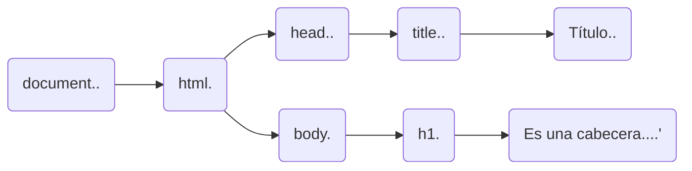
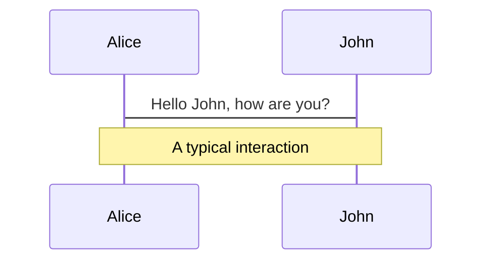
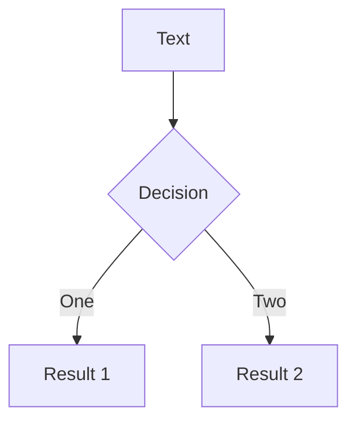

# Introducción a Vue.js 3

<div class="pt-12">
  <span @click="$slidev.nav.next" class="px-2 py-1 rounded cursor-pointer" hover="bg-white bg-opacity-10">
    Empecemos <carbon:arrow-right class="inline"/>
  </span>
</div>

<div class="abs-br m-6 flex gap-2">
  <button @click="$slidev.nav.openInEditor()" title="Open in Editor" class="text-xl icon-btn opacity-50 !border-none !hover:text-white">
    <carbon:edit />
  </button>
  <a href="https://github.com/FranzAnt/Vue-3-Intro-Slide" target="_blank" alt="GitHub"
    class="text-xl icon-btn opacity-50 !border-none !hover:text-white">
    <carbon-logo-github />
  </a>
</div>


---
layout: section
---

# Conceptos


---

# ¿Qué es ?

Dom significa Document Object Model, y es la interfaz de nuestro navegador (API) para cambiar lo que se muestra en el navegador.

<div class="grid grid-cols-3 gap-10 pt-4 -mb-1">

```html {all|1|1-6|9|all}

<!DOCTYPE html>
<html lang="es">
  <head>
      <title>Título</title>
  </head>
  <body>
    <h1>Es una cabecera</h1>
  </body>
</html>

```




</div>


<arrow v-click="2" x1="400" y1="420" x2="230" y2="330" color="#564" width="3" arrowSize="1" />

<style>
.footnotes-sep {
  @apply mt-20 opacity-10;
}
.footnotes {
  @apply text-sm opacity-75;
}
.footnote-backref {
  display: none;
}
</style>


---

# ¿Cómo se manipula el DOM?

Usamos JavaScript para manipular DOM, así: 


```js
let item = document.getElementsByTagName("h1")[0];
item.textContent = "Nueva Cabecera";

```


---

# Problema con el DOM

El problema subyacente con el uso y la manipulación del DOM es que algunas páginas tienen miles de nodos.


Es por eso que algunos marcos (como Vue) tienen algo llamado DOM virtual. El DOM virtual es una forma de representar el DOM real con objetos JavaScript.


---

# La solución


Arriba puede ver cómo podemos expresar un div como un objeto JavaScript. A continuación, sabrá cómo tomar este nodo virtual y realizar las llamadas de JavaScript adecuadas para crear un nodo DOM real en el navegador. En realidad, hay un paso adicional en este ciclo de vida, llamado funciones de renderizado.

---

# ¿Qué es Vue?

Vue (pronunciado / vjuː /, como vista) es un marco progresivo para construir interfaces de usuario.


- A diferencia de otros marcos monolíticos, Vue está diseñado desde cero para ser adoptable de forma incremental. 
- La biblioteca principal se centra solo en la capa de vista y es fácil de recoger e integrar con otras bibliotecas o proyectos existentes.
- Vue también es perfectamente capaz de impulsar aplicaciones sofisticadas de una sola página cuando se usa en combinación con [herramientas modernas](https://v3.vuejs.org/guide/single-file-component.html) y [bibliotecas de soporte](https://github.com/vuejs/awesome-vue#components--libraries) .
<br>
<br>

Puedes leer más de [¿Por qué Vue?](https://v3.vuejs.org/guide/introduction.html)


<style>
h1 {
  background-color: #2B90B6;
  background-image: linear-gradient(45deg, #4EC5D4 10%, #146b8c 20%);
  background-size: 100%;
  -webkit-background-clip: text;
  -moz-background-clip: text;
  -webkit-text-fill-color: transparent; 
  -moz-text-fill-color: transparent;
}
</style>

<!--
The last comment block of each slide will be treated as slide notes. It will be visible and editable in Presenter Mode along with the slide. [Read more in the docs](https://sli.dev/guide/syntax.html#notes)
-->

---

# ¿Qué es una función de renderizado?

La función de render es lo que crea el nodo virtual, que se envía a Vue para actualizar el DOM.


<div class="grid mx-2">


  </div>


---

# ¿Qué es una función de renderizado?

La función de render es lo que crea el nodo virtual, que se envía a Vue para actualizar el DOM. Más tarde, si los datos utilizados por la función de renderizado cambian, la función de renderizado se ejecutará nuevamente produciendo un nuevo nodo DOM virtual. Luego, Vue toma el nodo antiguo y el nuevo, compara los dos y realiza las llamadas DOM apropiadas para cambiar la página web.

<div class="grid mx-28">
  
</div>

<!--
La función de render es lo que crea el nodo virtual, que se envía a Vue para actualizar el DOM. Más tarde, si los datos utilizados por la función de renderizado cambian, la función de renderizado se ejecutará nuevamente produciendo un nuevo nodo DOM virtual. Luego, Vue toma el nodo antiguo y el nuevo, compara los dos y realiza las llamadas DOM apropiadas para cambiar la página web.
-->

---

# Una analogía del DOM virtual


<div grid="~ cols-2 gap-4">
  <div>

   <div class="grid mx-24">
        
    </div>
  </div>
<div>
  Deseo realizar  cambios en piso 29 de un edificio de 100 pisos


  - Puedo demoler todo en el piso 29 y empezar de cero.
  - Puedo crear nuevos planos, comparar las diferencias y realizar actualizaciones con la mínima cantidad de trabajo.
</div>
</div>


---

# Anatomía de Vue 3


<div grid="~ cols-3 gap-4">
<div>

### Módulo de reactividad
Los objetos reactivos se inicializan 

</div>
<div>

### Módulo compilador

  Se convierte el HTML en una función de renderizado.

 
</div>
  
  
<div>
  
### Módulo Renderer. 
  Se compone de 3 fases:
- Fase de renderizado
- Fase de montaje (o creación)
- Fase de parche (o actualización)

</div>
</div>

<!--
Preguntar que es la reactividad.
Módulo de reactividad. Esto permite crear objetos reactivos de JavaScript que pueden observarse en busca de cambios. Cuando se ejecuta el código que utiliza estos objetos, se realiza un seguimiento para ejecutarlo más tarde si cambia el objeto reactivo. 
Módulo compilador. Esto sabe cómo tomar plantillas HTML y compilarlas en funciones de renderizado. Esto puede suceder en el navegador en tiempo de ejecución, pero ocurre más a menudo cuando se crea un proyecto de Vue, por lo que un navegador solo recibe funciones de renderizado. 
Módulo Renderer. El renderizador contiene el código para 3 fases diferentes de renderizado de un componente en una página web. 
Fase de renderizado. Cuando se llama a la función de renderización y devuelve una representación del DOM real llamado DOM virtual. El DOM virtual es una representación de objeto JavaScript de lo que se procesará en el navegador. 
Fase de montaje (o creación): el renderizador toma el objeto DOM virtual y realiza llamadas JavaScript DOM reales para crear una página web. 
Fase de parche (o actualización): el renderizador toma los dos objetos DOM virtual, uno antiguo y uno nuevo, y actualiza solo las partes de la página web que han cambiado usando llamadas DOM JavaScript.
-->


---
layout: section
---

# Configuración


---

# Herramientas

IDE:    
- Visual Code
	
    Descarga: https://code.visualstudio.com/download 


Complementos
- Vetur
- Es6-string-html
- Live Server

---

# Repositorio

- Descarga git
https://git-scm.com/downloads 
- Clona el proyecto: 
	git clone https://github.com/FranzAnt/Vue-3-Intro
- git checkout CX_base
- git checkout CX_fin


---
layout: section
---

# Empecemos


---

# Estructura

<div class="grid mx-2">


  </div>


---

# ¿Qué veremos?


- Creación de la aplicación Vue

- ENLAZADO de atributos 

- RENDERIZADO condicional

- RENDERIZADO DE LISTAS

- Manejo de eventos

- ENLAZADO DE clases y estilos

- Propiedades COMPUTADAS

- OBSERVADORES

- Formularios y V-model

- Componentes


---

# Creación de la aplicación Vue


Use code snippets and get the highlighting directly!

Colocamos en main.js :
```js
const options = {
	data: () =>({
      
    })
}

const app = Vue.createApp(options)
```

Agregamos en nuestro index.html :
```html
<script>
  const appMount = app.mount('#app')
</script>
```


---

# Creación de la aplicación Vue

Finalmente tendriamos:
```html
<!DOCTYPE html>
<html lang="es">
  <head>
    <meta charset="UTF-8" />
    <title>Taller de Vue 3</title>
    <!-- Import Styles -->
    <link rel="stylesheet" href="./assets/styles.css" />
    <!-- Import Vue.js -->
    <script src="https://unpkg.com/vue@3.0.0/dist/vue.global.js"></script>
  </head>
  <body>
    <div id="app">
      <h1>Ejemplo</h1>
    </div>

    <!-- Import Js -->
    <script src="./main.js"></script>
    <script>
        const appMount = app.mount('#app')
      </script>
  </body>
</html>
```


---


---

# Components

<div grid="~ cols-2 gap-4">
<div>

You can use Vue components directly inside your slides.

We have provided a few built-in components like `<Tweet/>` and `<Youtube/>` that you can use directly. And adding your custom components is also super easy.

```html
<Counter :count="10" />
```

<!-- ./components/Counter.vue -->
<Counter :count="10" m="t-4" />

Check out [the guides](https://sli.dev/builtin/components.html) for more.

</div>
<div>

```html
<Tweet id="1390115482657726468" />
```

<Tweet id="1390115482657726468" scale="0.65" />

</div>
</div>


---
class: px-20
---

# Themes

Slidev comes with powerful theming support. Themes can provide styles, layouts, components, or even configurations for tools. Switching between themes by just **one edit** in your frontmatter:

<div grid="~ cols-2 gap-2" m="-t-2">

```yaml
---
theme: default
---
```

```yaml
---
theme: seriph
---
```


</div>

Read more about [How to use a theme](https://sli.dev/themes/use.html) and
check out the [Awesome Themes Gallery](https://sli.dev/themes/gallery.html).

---
preload: false
---

# Animations

Animations are powered by [@vueuse/motion](https://motion.vueuse.org/).

```html
<div
  v-motion
  :initial="{ x: -80 }"
  :enter="{ x: 0 }">
  Slidev
</div>
```

<div class="w-60 relative mt-6">
  <div class="relative w-40 h-40">
    
    
    
  </div>

  <div 
    class="text-5xl absolute top-14 left-40 text-[#2B90B6] -z-1"
    v-motion
    :initial="{ x: -80, opacity: 0}"
    :enter="{ x: 0, opacity: 1, transition: { delay: 2000, duration: 1000 } }">
    Slidev
  </div>
</div>

<!-- vue script setup scripts can be directly used in markdown, and will only affects current page -->
<script setup lang="ts">
const final = {
  x: 0,
  y: 0,
  rotate: 0,
  scale: 1,
  transition: {
    type: 'spring',
    damping: 10,
    stiffness: 20,
    mass: 2
  }
}
</script>

<div
  v-motion
  :initial="{ x:35, y: 40, opacity: 0}"
  :enter="{ y: 0, opacity: 1, transition: { delay: 3500 } }">

[Learn More](https://sli.dev/guide/animations.html#motion)

</div>

---

# LaTeX

LaTeX is supported out-of-box powered by [KaTeX](https://katex.org/).

<br>

Inline $\sqrt{3x-1}+(1+x)^2$

Block
$$
\begin{array}{c}

\nabla \times \vec{\mathbf{B}} -\, \frac1c\, \frac{\partial\vec{\mathbf{E}}}{\partial t} &
= \frac{4\pi}{c}\vec{\mathbf{j}}    \nabla \cdot \vec{\mathbf{E}} & = 4 \pi \rho \\

\nabla \times \vec{\mathbf{E}}\, +\, \frac1c\, \frac{\partial\vec{\mathbf{B}}}{\partial t} & = \vec{\mathbf{0}} \\

\nabla \cdot \vec{\mathbf{B}} & = 0

\end{array}
$$

<br>

[Learn more](https://sli.dev/guide/syntax#latex)

---

# Diagrams

You can create diagrams / graphs from textual descriptions, directly in your Markdown.

<div class="grid grid-cols-2 gap-10 pt-4 -mb-6">





</div>

[Learn More](https://sli.dev/guide/syntax.html#diagrams)


---
layout: center
class: text-center
---

# Learn More

[Documentations](https://sli.dev) · [GitHub](https://github.com/slidevjs/slidev) · [Showcases](https://sli.dev/showcases.html)
